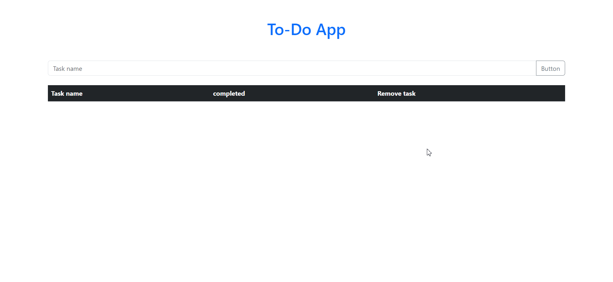

# To-Do List Project Overview

This project is a simple To-Do List application implemented using HTML, CSS, and JavaScript. The primary features include adding tasks, marking tasks as completed, and deleting tasks. The application supports local storage, allowing users to persist their to-do list even after refreshing the page

